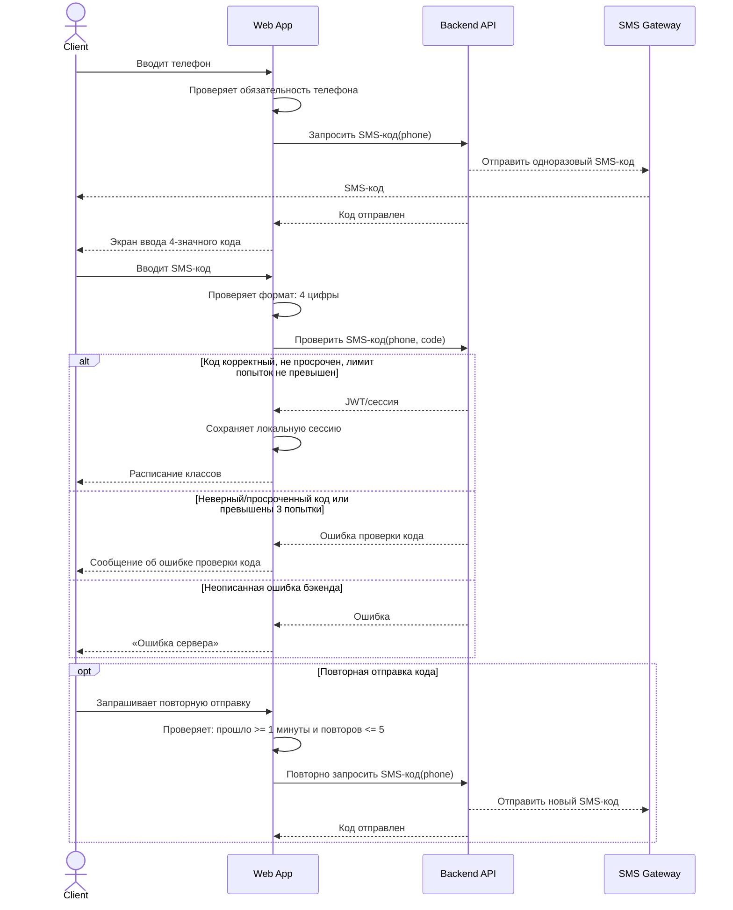
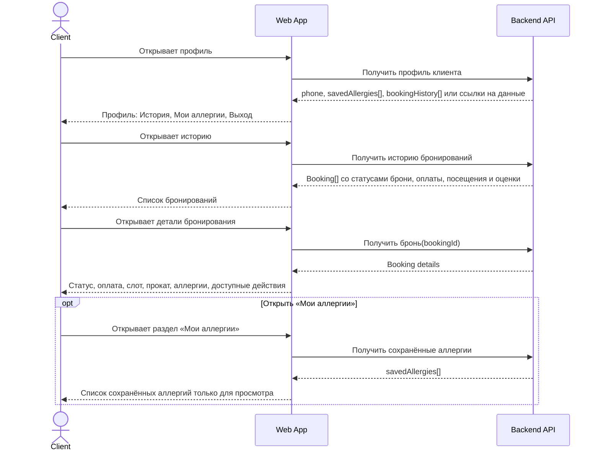
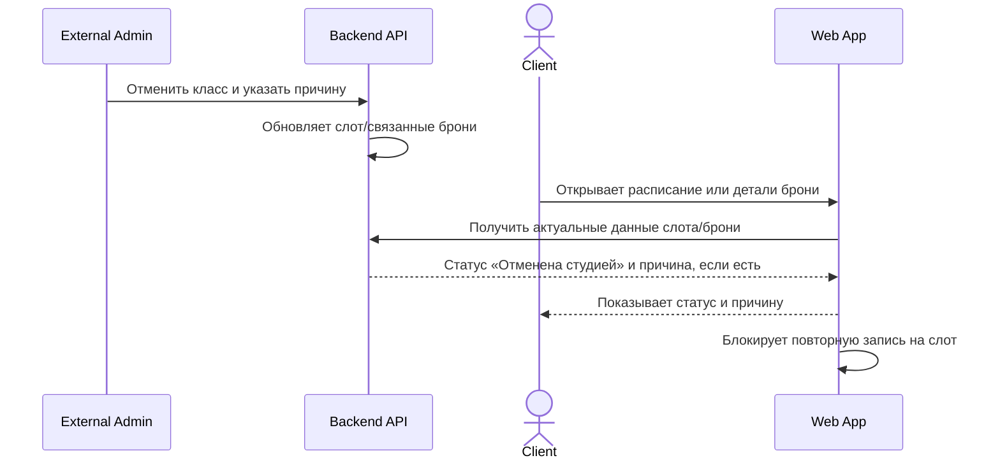

# API Sequence

## Scope

Документ описывает API-последовательности клиентского адаптивного веб-приложения «Шеф-стол» для MVP.

Границы системы:

- В скоупе только роль **Клиент**.
- Клиентское приложение работает с существующим бэкендом как black-box API и источником истины.
- Клиентское приложение не создаёт и не редактирует расписание, слоты, программы, шефов, фонд проката и административные отмены.
- Бэкенд отвечает за бизнес-правила, атомарность бронирования, статусы, цены проката, списание доступности проката, возврат места при отмене и пересчёт среднего рейтинга шефа.
- Push/email/SMS-уведомления о событиях вне MVP; SMS используется только для авторизации.
- Точные URL, HTTP-методы, форматы payload и коды ошибок в источниках не указаны; ниже используются логические операции API.

## Key scenarios

1. Авторизация по телефону и SMS-коду.
2. Просмотр и фильтрация расписания.
3. Просмотр деталей слота и старт бронирования.
4. Создание брони: прокат → аллергии → сводка → подтверждение.
5. Просмотр профиля, истории и деталей бронирования.
6. Отмена брони клиентом.
7. Отображение отмены класса студией.
8. Оценка шефа.
9. Выход из системы.

## Scenario 1 — Авторизация по телефону и SMS-коду

### Lifelines

- Client — клиент.
- Web App — клиентское веб-приложение.
- Backend API — существующий бэкенд.
- SMS Gateway — внешний SMS-шлюз, настроенный вне скоупа приложения.

### Trigger

Клиент открывает приложение без активной сессии или переходит к защищённому сценарию без авторизации.

### API flow



### Validations and errors

- Телефон обязателен; формат телефона не указан.
- SMS-код: 4 цифры, срок жизни 5 минут, максимум 3 попытки ввода.
- Повторная отправка: не ранее чем через 1 минуту, максимум 5 повторных отправок.
- Для неописанных ошибок бэкенда показывается «Ошибка сервера».

### Result

При успешной проверке кода клиент получает JWT/сессию и переходит к расписанию.

## Scenario 2 — Просмотр и фильтрация расписания

### Lifelines

- Client.
- Web App.
- Backend API.

### Trigger

Авторизованный клиент открывает экран «Расписание классов» или применяет фильтры.

### API flow

```mermaid
sequenceDiagram
    actor Client
    participant WebApp as Web App
    participant Backend as Backend API

    Client->>WebApp: Открывает расписание
    WebApp->>WebApp: Проверяет наличие сессии
    WebApp->>Backend: Получить расписание на ближайшие 7 дней
    Backend-->>WebApp: Слоты, программы, шефы, доступность мест, признаки духовки/проката

    alt Есть доступные классы
        WebApp-->>Client: Карточки слотов
    else Нет доступных классов
        WebApp-->>Client: «Пока нет доступных классов.»
    else Неописанная ошибка бэкенда
        Backend-->>WebApp: Ошибка
        WebApp-->>Client: «Ошибка сервера»
    end

    Client->>WebApp: Открывает фильтры
    WebApp-->>Client: Фильтры даты/диапазона, программы/меню, шефа, уровня, мест, проката
    Client->>WebApp: Применяет фильтры
    WebApp->>Backend: Получить расписание с фильтрами
    Backend-->>WebApp: Отфильтрованные слоты
    WebApp->>WebApp: Отображает результат; фильтры применяются по И-логике
    WebApp-->>Client: Список слотов или пустое состояние
```

### Validations and errors

- Авторизация обязательна.
- По умолчанию показываются ближайшие 7 дней.
- Фильтры работают по И-логике.
- Карточки недоступных/отменённых слотов не должны вести к бронированию.
- При неописанной ошибке бэкенда показывается «Ошибка сервера».

### Result

Клиент видит список классов или пустое состояние и может перейти к деталям доступного слота.

## Scenario 3 — Просмотр деталей слота и старт бронирования

### Lifelines

- Client.
- Web App.
- Backend API.

### Trigger

Клиент выбирает слот в расписании.

### API flow

```mermaid
sequenceDiagram
    actor Client
    participant WebApp as Web App
    participant Backend as Backend API

    Client->>WebApp: Открывает слот
    WebApp->>WebApp: Проверяет наличие сессии
    WebApp->>Backend: Получить детали слота(slotId)
    Backend-->>WebApp: Слот, программа/меню, шеф, адрес, места, уровень, признаки проката/духовки

    alt Слот доступен
        WebApp-->>Client: Детали класса и CTA «Забронировать»
    else availableSeats = 0
        WebApp-->>Client: Детали класса; бронирование недоступно
    else Слот отменён студией
        Backend-->>WebApp: Статус/признак отмены и причина
        WebApp-->>Client: Статус «Отменена студией»/причина; повторная запись запрещена
    else Неописанная ошибка бэкенда
        Backend-->>WebApp: Ошибка
        WebApp-->>Client: «Ошибка сервера»
    end

    Client->>WebApp: Нажимает «Забронировать»
    alt availableSeats > 0 и слот не отменён студией
        WebApp->>Backend: Получить доступный прокат и аллергены для шага бронирования
        Backend-->>WebApp: RentalItem[], Allergen[], savedAllergies[]
        WebApp-->>Client: Шаг выбора проката
    else Нет мест
        WebApp-->>Client: Уведомление об отсутствии мест
    else Слот отменён студией
        WebApp-->>Client: Повторная запись запрещена
    end
```

### Validations and errors

- Бронирование возможно только если `availableSeats > 0` и слот не отменён студией.
- При отсутствии мест показывается уведомление об отсутствии мест.
- При отмене студией показывается причина, если она получена от бэкенда.

### Result

Клиент либо переходит к выбору проката, либо получает объяснение, почему бронирование невозможно.

## Scenario 4 — Создание брони

### Lifelines

- Client.
- Web App.
- Backend API.

### Trigger

Клиент прошёл шаги выбора проката и аллергий и нажал «Подтвердить бронь» на итоговой сводке.

### API flow

```mermaid
sequenceDiagram
    actor Client
    participant WebApp as Web App
    participant Backend as Backend API

    WebApp-->>Client: Список RentalItem; позиции stockAvailable = 0 недоступны
    Client->>WebApp: Выбирает ноль или несколько доступных позиций проката
    WebApp->>WebApp: Не позволяет выбрать RentalItem со stockAvailable = 0

    WebApp-->>Client: Справочник аллергенов; сохранённые аллергии предвыбраны
    Client->>WebApp: Выбирает ноль, одну или несколько аллергий
    WebApp->>WebApp: Не допускает аллергенов вне справочника

    WebApp-->>Client: Итоговая сводка: 1 место, слот, прокат, аллергии, оплата на месте
    Client->>WebApp: Подтверждает бронь
    WebApp->>Backend: Создать бронь(slotId, selectedRentalItems[], selectedAllergies[])

    alt Бронирование успешно
        Backend->>Backend: Атомарно проверяет availableSeats > 0
        Backend->>Backend: Проверяет запрет записи на отменённый студией слот
        Backend->>Backend: Списывает место и stockAvailable выбранного проката
        Backend->>Backend: Сохраняет аллергии в брони и профиле клиента
        Backend-->>WebApp: Booking со статусом «Активна»
        WebApp-->>Client: Экран «Бронь подтверждена»
    else Нет свободных мест
        Backend-->>WebApp: Отказ: нет мест
        WebApp-->>Client: Уведомление об отсутствии мест
        WebApp-->>Client: Переход на листинг классов
    else Слот отменён студией до подтверждения
        Backend-->>WebApp: Отказ: слот отменён студией, причина если есть
        WebApp-->>Client: Статус/причина отмены; повторная запись запрещена
    else Неописанная ошибка бэкенда
        Backend-->>WebApp: Ошибка
        WebApp-->>Client: «Ошибка сервера»
    end
```

### Validations and errors

- В одной брони бронируется только 1 место.
- Прокат необязателен; выбрать можно только позиции с `stockAvailable > 0`.
- Аллергии необязательны; выбрать можно только аллергены из справочника.
- Бронь создаётся только при `availableSeats > 0`.
- Атомарность создания брони и предотвращение двойного бронирования обеспечиваются бэкендом.
- Повторная запись на слот, отменённый студией, запрещена.
- Retry не описан; при неописанной ошибке показывается «Ошибка сервера».
- Rollback на клиенте не описан; откат места/проката относится к атомарной операции бэкенда.

### Result

При успехе создана бронь со статусом «Активна»; при отказе бронь не создаётся.

## Scenario 5 — Просмотр профиля, истории и деталей бронирования

### Lifelines

- Client.
- Web App.
- Backend API.

### Trigger

Авторизованный клиент открывает профиль, историю бронирований, детали бронирования или раздел «Мои аллергии».

### API flow



### Validations and errors

- Авторизация обязательна.
- История показывает статусы брони, статус оплаты только «Не оплачено» или «Оплачено», данные класса, шефа, дату/время, выбранные аллергии и экипировку.
- Редактирование аллергий в профиле не допускается; изменение набора возможно только через сценарий бронирования.
- Пагинация/ленивая загрузка истории не описаны.

### Result

Клиент видит профиль, историю, детали брони и может перейти к допустимой отмене или оценке.

## Scenario 6 — Отмена брони клиентом

### Lifelines

- Client.
- Web App.
- Backend API.

### Trigger

Клиент нажимает «Отменить бронь» в деталях активной брони.

### API flow

```mermaid
sequenceDiagram
    actor Client
    participant WebApp as Web App
    participant Backend as Backend API

    Client->>WebApp: Нажимает «Отменить бронь»
    WebApp->>WebApp: Проверяет по данным брони: до старта > 12 часов

    alt До начала класса больше 12 часов
        WebApp-->>Client: Подтверждение отмены
        Client->>WebApp: Подтверждает отмену
        WebApp->>Backend: Отменить бронь(bookingId)
        Backend->>Backend: Проверяет активность брони и правило > 12 часов
        Backend->>Backend: Возвращает место
        Backend-->>WebApp: Booking со статусом «Отменена клиентом»
        WebApp-->>Client: Обновлённые детали брони
    else До начала класса 12 часов или меньше
        WebApp-->>Client: «Отмена недоступна менее чем за 12 часов до класса»
    else Бронь уже отменена или класс отменён студией
        WebApp-->>Client: Отмена недоступна; отображается актуальный статус
    else Неописанная ошибка бэкенда
        Backend-->>WebApp: Ошибка
        WebApp-->>Client: «Ошибка сервера»
    end
```

### Validations and errors

- Отмена доступна только для активной брони более чем за 12 часов до начала класса.
- Если порог 12 часов пересечён во время сценария, бэкенд может отказать; показывается сообщение поздней отмены.
- Причина отмены клиентом не описана и не передаётся.
- Возврат места выполняется бэкендом.
- Штрафы, возвраты денег, компенсации и переносы вне MVP.

### Result

При успехе бронь получает статус «Отменена клиентом»; при поздней отмене статус не меняется.

## Scenario 7 — Отображение отмены класса студией

### Lifelines

- External Admin — внешняя административная система вне MVP.
- Backend API.
- Client.
- Web App.

### Trigger

Класс отменён студией во внешней админке; клиент открывает расписание, историю или детали бронирования.

### API flow



### Sync/async interactions

- Отмена класса студией происходит вне клиентского приложения.
- Клиентское приложение не получает push/email/SMS в MVP; актуальный статус отображается при запросе данных у бэкенда.

### Result

Клиент видит, что бронь/класс отменены студией, причину отмены и не может повторно записаться на этот слот.

## Scenario 8 — Оценка шефа

### Lifelines

- Client.
- Web App.
- Backend API.

### Trigger

Клиент открывает историю или детали завершённой посещённой брони, по которой оценка ещё не отправлялась.

### API flow

```mermaid
sequenceDiagram
    actor Client
    participant WebApp as Web App
    participant Backend as Backend API

    Client->>WebApp: Открывает историю/детали брони
    WebApp->>Backend: Получить данные брони/истории
    Backend-->>WebApp: Флаги: класс завершён, клиент посетил, оценка не отправлялась

    alt Оценка доступна
        WebApp-->>Client: CTA «Оценить шефа»
        Client->>WebApp: Выбирает 1–5 звёзд и необязательный комментарий
        WebApp->>WebApp: Проверяет, что stars выбран и находится в диапазоне 1..5
        WebApp->>Backend: Отправить оценку(bookingId, chefId, stars, comment)
        Backend->>Backend: Сохраняет оценку один раз
        Backend->>Backend: Пересчитывает avgRating шефа
        Backend-->>WebApp: Оценка сохранена
        WebApp-->>Client: Оценка отправлена; повторная оценка недоступна
    else Класс не завершён, не посещён или уже оценён
        WebApp-->>Client: Оценка недоступна
    else Неописанная ошибка бэкенда
        Backend-->>WebApp: Ошибка
        WebApp-->>Client: «Ошибка сервера»
    end
```

### Validations and errors

- Оценка доступна только после завершённого посещённого класса.
- Оценка обязательна и принимает значение 1–5.
- Комментарий необязателен.
- Повторная оценка и изменение оценки по одной брони запрещены.
- Публично отображается только средний рейтинг шефа; комментарии не являются публичными отзывами.

### Result

Оценка сохранена, повторная оценка недоступна, средний рейтинг шефа пересчитывается бэкендом.

## Scenario 9 — Выход из системы

### Lifelines

- Client.
- Web App.
- Backend API.

### Trigger

Клиент нажимает выход в профиле и подтверждает действие.

### API flow

```mermaid
sequenceDiagram
    actor Client
    participant WebApp as Web App
    participant Backend as Backend API

    Client->>WebApp: Нажимает «Выйти»
    WebApp-->>Client: Подтверждение выхода
    Client->>WebApp: Подтверждает выход
    WebApp->>Backend: Отозвать токен/сессию

    alt Токен отозван
        Backend-->>WebApp: Успех
        WebApp->>WebApp: Удаляет локальную сессию/токен
        WebApp-->>Client: Сессия завершена / экран входа
    else Бэкенд недоступен при отзыве токена
        Backend-->>WebApp: Ошибка или тайм-аут
        WebApp->>WebApp: Удаляет локальную сессию/токен
        WebApp-->>Client: Нейтральное сообщение о выходе
    else Локальную сессию удалить не удалось
        WebApp-->>Client: «Ошибка сервера»; клиент остаётся в текущем состоянии
    end
```

### Result

Локальная сессия завершена; защищённые экраны снова требуют авторизацию.

## Assumptions

- Логические API-операции названы по смыслу, потому что точные endpoint names, HTTP methods и payload schemas в источниках отсутствуют.
- Фильтрация расписания может выполняться на стороне бэкенда или с участием клиента; источник истины для данных остаётся бэкенд.
- Перед стартом бронирования приложение получает актуальные справочники проката, аллергенов и сохранённые аллергии клиента от бэкенда.
- Bottom Sheet подтверждения отмены и выхода указан в design brief как inferred UX-паттерн; API-операция выполняется только после подтверждения клиента.

## Open questions

- Точные URL, HTTP-методы, request/response schemas и коды ошибок API не указаны.
- Формат телефона и маска ввода не указаны.
- Точный формат даты/времени и часовой пояс отображения не указаны.
- Точный набор статусов брони кроме «Активна», «Отменена клиентом», «Отменена студией» не указан.
- Точное имя и тип признака отмены слота студией не указаны.
- Тексты ошибок для неверного/просроченного SMS-кода и превышения лимитов не указаны.
- Поведение при сетевом тайм-ауте или offline явно не описано.
