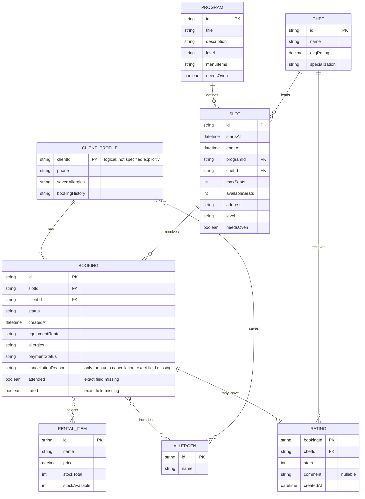

# Data Model

## Scope

Документ описывает доменную модель данных и ERD для клиентского веб-приложения «Шеф-стол» на уровне, достаточном для проектирования интеграции с существующим бэкендом.

Границы модели:

- Бэкенд является источником истины для всех данных, статусов и бизнес-операций.
- Клиентское приложение не управляет расписанием, слотами, программами, шефами и фондом проката.
- Модель не добавляет сущности для онлайн-оплаты, промокодов, waitlist, переносов, штрафов, push/email/SMS-уведомлений, лояльности и публичных отзывов, потому что они вне MVP.
- Точные физические таблицы, типы данных, индексы и API schemas в источниках не указаны; связи описаны на доменном уровне.

## Entities

### ClientProfile

**Purpose:** профиль клиента, авторизуемого по телефону, с сохранёнными аллергиями и историей бронирований.

**Key attributes:**

- `phone` — номер телефона клиента.
- `savedAllergies[]` — сохранённые аллергии клиента.
- `bookingHistory[]` — история бронирований клиента.

**Primary key:**

- Не указан в источниках. Для связей используется логический `clientId`, потому что он указан в сущности `Booking`.

**Foreign keys:**

- Нет явно указанных FK.

**Unique constraints:**

- Не указаны. Уникальность `phone` логически вероятна для SMS-авторизации, но в источниках прямо не зафиксирована.

**Nullable / mandatory:**

- `phone` обязателен для авторизации.
- `savedAllergies[]` может быть пустым.
- `bookingHistory[]` может быть пустым.

**Lifecycle / statuses:**

- Клиент получает JWT/сессию после успешной проверки SMS-кода.
- При выходе локальная сессия удаляется, токен отзывается на бэкенде.

### Slot

**Purpose:** класс/слот расписания, доступный для просмотра и бронирования.

**Key attributes:**

- `id`.
- `startsAt`.
- `endsAt` — длительность около 3 часов.
- `programId`.
- `chefId`.
- `maxSeats` — 8 или 12.
- `availableSeats`.
- `address`.
- `level`.
- `needsOven`.

**Primary key:** `id`.

**Foreign keys:**

- `programId` → `Program.id`.
- `chefId` → `Chef.id`.

**Unique constraints:**

- Не указаны.

**Nullable / mandatory:**

- Обязательность полей не специфицирована; для сценариев расписания и бронирования нужны все перечисленные атрибуты.

**Lifecycle / statuses:**

- Бэкенд отдаёт слоты на ближайшие 7 дней по умолчанию.
- Повторная запись на слот, отменённый студией, запрещена.
- Точное поле статуса/признака отмены слота студией не указано.

### Program

**Purpose:** программа/меню кулинарного класса.

**Key attributes:**

- `id`.
- `title`.
- `description`.
- `level`.
- `menuItems[]`.
- `needsOven`.

**Primary key:** `id`.

**Foreign keys:** нет.

**Unique constraints:** не указаны.

**Nullable / mandatory:** не указано; `title`, `description`, `level`, `menuItems[]`, `needsOven` нужны для отображения деталей и фильтрации.

**Lifecycle / statuses:**

- Создание и редактирование программ вне скоупа клиентского приложения.

### Chef

**Purpose:** шеф, ведущий класс и доступный для отображения/фильтрации.

**Key attributes:**

- `id`.
- `name`.
- `avgRating`.
- `specialization[]`.

**Primary key:** `id`.

**Foreign keys:** нет.

**Unique constraints:** не указаны.

**Nullable / mandatory:** не указано; `name` и `avgRating` используются в UI, `specialization[]` отображается в публичной информации.

**Lifecycle / statuses:**

- Шеф не имеет интерфейса в клиентском приложении.
- `avgRating` пересчитывается бэкендом после сохранения оценки.
- Публично отображается только средний рейтинг, не индивидуальные отзывы.

### Booking

**Purpose:** бронь клиента на конкретный слот.

**Key attributes:**

- `id`.
- `slotId`.
- `clientId`.
- `status`.
- `createdAt`.
- `equipmentRental[]`.
- `allergies[]`.
- `paymentStatus`.
- `cancellationReason` — причина отмены студией, если класс отменён студией; точное имя поля не указано.
- Attendance flag — флаг фактического посещения, возвращаемый бэкендом для доступности оценки; точное имя поля не указано.
- Rating flag — флаг «оценил/не оценил», возвращаемый бэкендом для запрета повторной оценки; точное имя поля не указано.

**Primary key:** `id`.

**Foreign keys:**

- `slotId` → `Slot.id`.
- `clientId` → `ClientProfile` логический идентификатор клиента.

**Unique constraints:**

- В одной брони бронируется 1 место.
- Уникальное ограничение на повторную оценку реализуется через связь с `Rating`: одна оценка на одну бронь.
- Прямое ограничение «один клиент — одна бронь на слот» в источниках не указано.

**Nullable / mandatory:**

- `slotId`, `clientId`, `status`, `createdAt`, `paymentStatus` нужны для сценариев MVP.
- `equipmentRental[]` может быть пустым.
- `allergies[]` может быть пустым.
- `cancellationReason` применима только при отмене студией; формат и обязательность причины не указаны.
- Attendance и Rating flags нужны для доступности оценки, но точные поля не специфицированы.

**Lifecycle / statuses:**

- Создаётся бэкендом атомарно со статусом «Активна».
- При допустимой отмене клиентом получает статус «Отменена клиентом».
- При отмене класса студией отображается статус «Отменена студией» и причина.
- Точный набор остальных статусов брони не указан.
- `paymentStatus` отображается только как «Не оплачено» или «Оплачено».

### RentalItem

**Purpose:** позиция проката экипировки, доступная для выбора при бронировании.

**Key attributes:**

- `id`.
- `name`.
- `price`.
- `stockTotal`.
- `stockAvailable`.

**Primary key:** `id`.

**Foreign keys:** нет.

**Unique constraints:** не указаны.

**Nullable / mandatory:** все перечисленные поля нужны для выбора и отображения проката; точная обязательность не указана.

**Lifecycle / statuses:**

- Если `stockAvailable = 0`, позиция недоступна.
- Прокат списывается из `stockAvailable` при создании брони бэкендом.
- Цена определяется бэкендом.
- В источниках указаны набор ножей и фартук как позиции проката.

### Allergen

**Purpose:** справочник аллергенов для выбора в бронировании и сохранения в профиле.

**Key attributes:**

- `id`.
- `name`.

**Primary key:** `id`.

**Foreign keys:** нет.

**Unique constraints:** не указаны.

**Nullable / mandatory:** `id` и `name` нужны для выбора из справочника.

**Lifecycle / statuses:**

- Выбор аллергенов необязателен.
- Клиент может выбрать несколько аллергенов только из справочника.
- Свободный ввод аллергий запрещён.
- Выбранные аллергии сохраняются в профиле и используются при следующих бронированиях.
- В профиле аллергии доступны только для просмотра; редактирование в профиле не предусмотрено.

### Rating

**Purpose:** оценка шефа по завершённому посещённому классу.

**Key attributes:**

- `bookingId`.
- `chefId`.
- `stars`.
- `comment`.
- `createdAt`.

**Primary key:**

- Не указан. На доменном уровне `bookingId` должен быть уникальным для запрета повторной оценки одной брони.

**Foreign keys:**

- `bookingId` → `Booking.id`.
- `chefId` → `Chef.id`.

**Unique constraints:**

- Одна оценка на одну бронь.

**Nullable / mandatory:**

- `bookingId`, `chefId`, `stars`, `createdAt` обязательны для сценария оценки.
- `stars` обязателен, диапазон 1–5.
- `comment` необязателен.

**Lifecycle / statuses:**

- Создаётся только после завершённого посещённого класса.
- Повторная оценка и изменение оценки по одной брони запрещены.
- После сохранения бэкенд пересчитывает `Chef.avgRating`.

## Relationships

| Relationship | Cardinality | Mandatory | Direction | Meaning |
|---|---:|---|---|---|
| `ClientProfile` → `Booking` | 1:N | Booking обязательно принадлежит клиенту; у клиента может быть 0..N броней | ClientProfile owns booking history | История бронирований клиента. |
| `Slot` → `Booking` | 1:N | Booking обязательно относится к одному Slot; у Slot может быть 0..N броней | Booking references Slot | Брони на конкретный класс; двойное бронирование мест предотвращает бэкенд через `availableSeats`. |
| `Program` → `Slot` | 1:N | Slot обязательно связан с Program | Slot references Program | Слот проводится по программе/меню. |
| `Chef` → `Slot` | 1:N | Slot обязательно связан с Chef | Slot references Chef | Шеф ведёт слот. |
| `Booking` ↔ `RentalItem` | M:N | Выбор проката необязателен | Booking selects RentalItem | В брони может быть несколько выбранных позиций проката; позиция может встречаться в разных бронях. |
| `Booking` ↔ `Allergen` | M:N | Выбор аллергий необязателен | Booking records selected Allergen | Аллергии, указанные для конкретной брони. |
| `ClientProfile` ↔ `Allergen` | M:N | Сохранённые аллергии необязательны | ClientProfile stores saved Allergen | Сохранённые аллергии клиента для предвыбора при следующих бронированиях. |
| `Booking` → `Rating` | 1:0..1 | Rating необязателен; если есть, принадлежит одной Booking | Rating references Booking | Оценка создаётся не более одного раза по брони. |
| `Chef` → `Rating` | 1:N | Rating обязательно относится к Chef | Rating references Chef | Оценки используются бэкендом для среднего рейтинга шефа. |

## ERD

## Integrity rules

1. `Booking` can be created only when `Slot.availableSeats > 0`.
2. `Booking` creation is atomic on the backend and must prevent double booking.
3. One `Booking` reserves exactly 1 seat.
4. `Slot.maxSeats` is 12, or 8 when `needsOven = true`.
5. Booking a `RentalItem` is allowed only when `stockAvailable > 0`.
6. Selected rental items are deducted from `stockAvailable` by the backend during booking creation.
7. `Allergen` selection is optional and must use only values from the allergen dictionary.
8. Selected booking allergies are saved in `ClientProfile.savedAllergies` and reused for later booking preselection.
9. `ClientProfile.savedAllergies` are read-only in the profile section; profile editing is outside MVP.
10. Client cancellation is allowed only for active bookings more than 12 hours before `Slot.startsAt`.
11. Late cancellation at 12 hours or less before class start is forbidden.
12. Studio-cancelled slots/bookings must show status «Отменена студией» and the cancellation reason if provided by backend.
13. Rebooking a slot cancelled by the studio is forbidden.
14. `Booking.paymentStatus` displayed in MVP is limited to «Не оплачено» and «Оплачено».
15. `Rating.stars` is mandatory and must be within 1..5.
16. `Rating.comment` is optional.
17. A `Rating` is allowed only for a completed attended class.
18. A booking can have at most one rating; repeat rating and rating edits are forbidden.
19. `Chef.avgRating` is recalculated by the backend; client displays only the average rating publicly.

## Assumptions

- `clientId` exists as a logical identifier because `Booking` contains `clientId`, although `ClientProfile` attributes in sources list only `phone`, `savedAllergies[]`, and `bookingHistory[]`.
- Associative M:N relationships for booking rentals, booking allergens and saved client allergens are shown as relationships, not separate domain entities, because source documents expose them as arrays.
- `cancellationReason`, attendance flag and rating flag are included as required API-returned data for documented scenarios, but exact field names are missing.
- `Rating.bookingId` is treated as unique/primary at domain level to enforce one rating per booking.

## Open questions

- Exact database schema, scalar data types and physical table names are not specified.
- Exact primary key of `ClientProfile` is not specified.
- Exact field name and type for studio cancellation status/reason are not specified.
- Exact field names for «посетил/не посетил» and «оценил/не оценил» flags are not specified.
- Exact full set of booking statuses beyond «Активна», «Отменена клиентом», «Отменена студией» is not specified.
- Exact uniqueness constraints for phone, slot/program/chef names and repeated client bookings on the same slot are not specified.
- Maximum length of rating comment is not specified.
- Pagination or archival rules for booking history are not specified.
